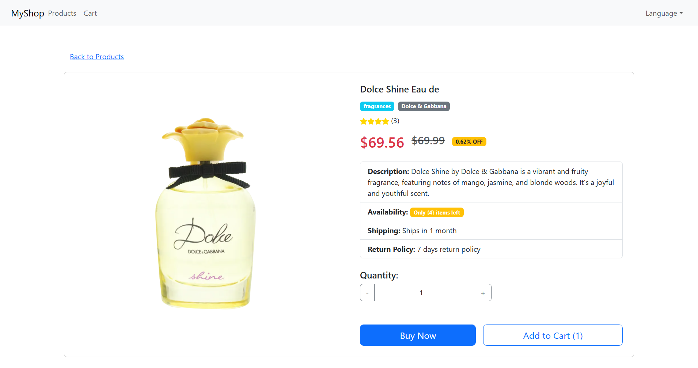
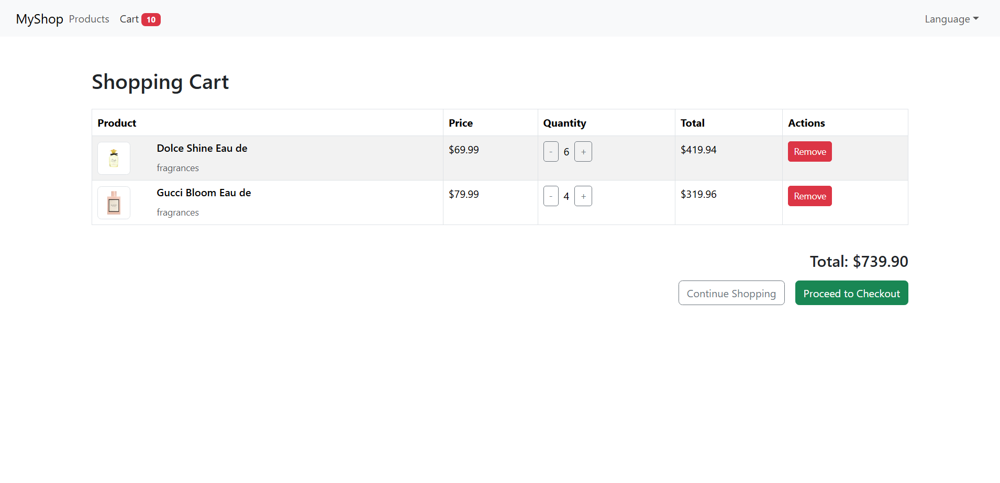
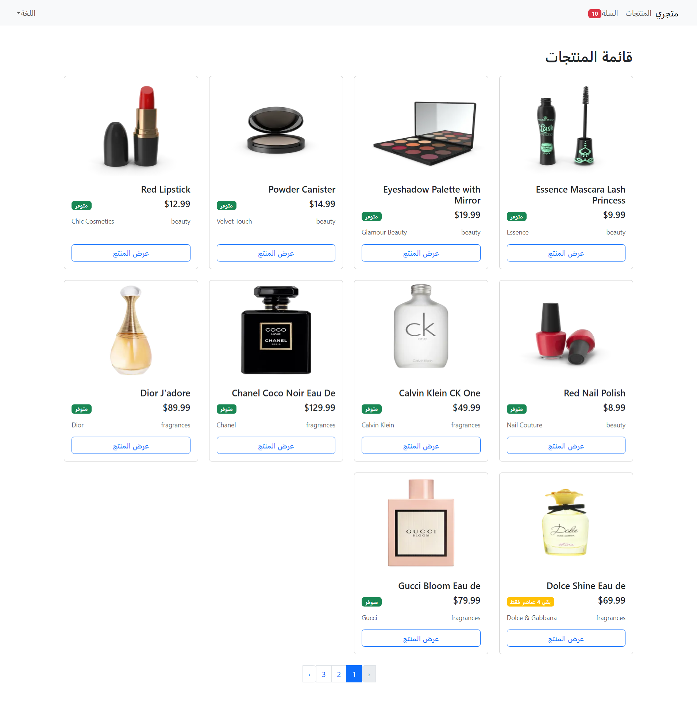
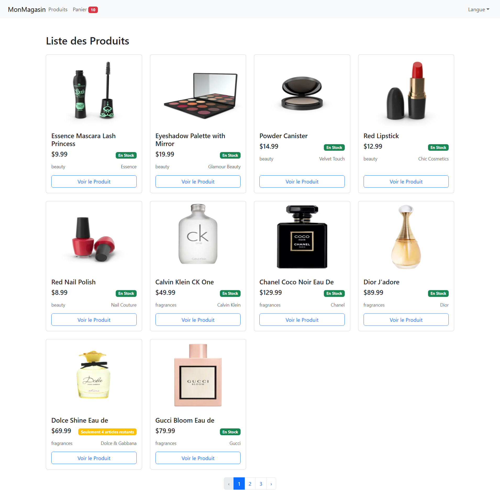
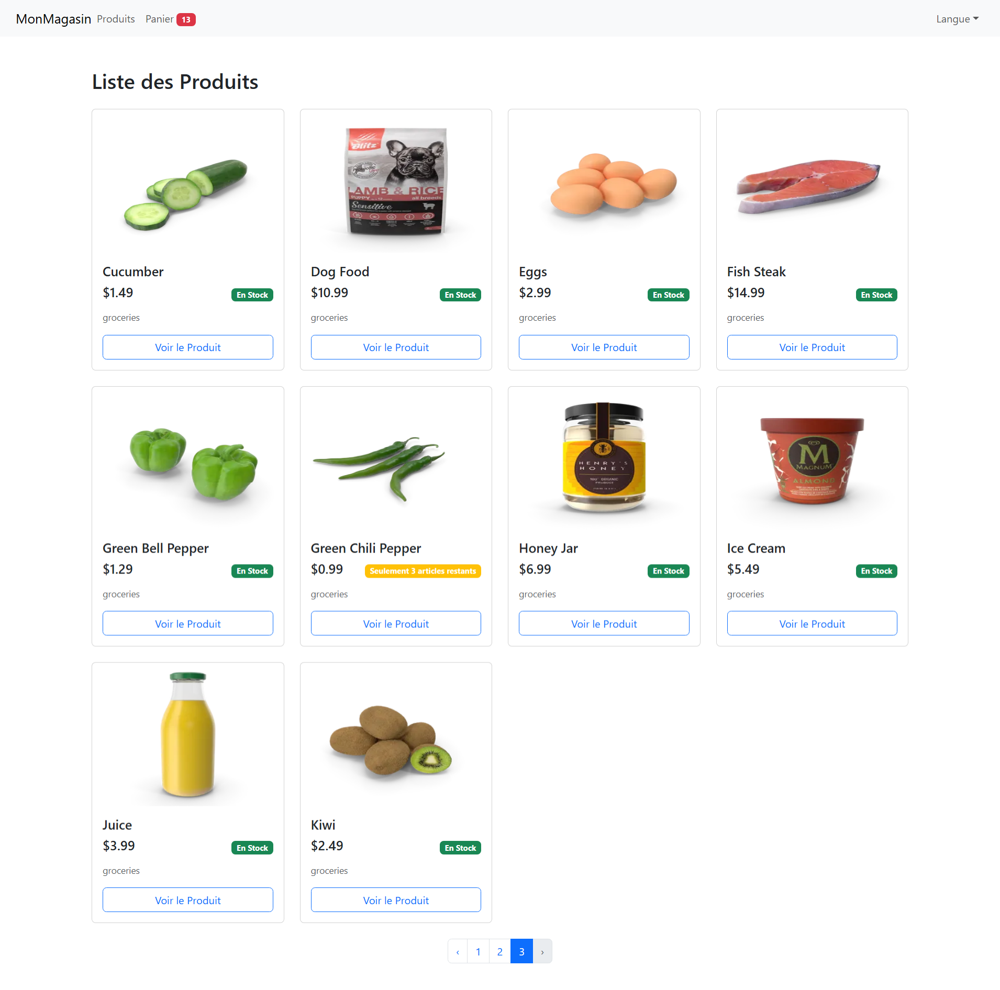

# 🛍️ ShopSphere

A modern, multi-language React-based e-commerce storefront built as part of the **ITI Python Full Stack Development Program – React Course (2025)**.
ShopSphere allows users to browse products, view details, manage their shopping cart, and seamlessly switch between **English**, **Arabic (RTL)**, and **French**.

---

## ✨ Features

* 🔍 **Product Catalog**
  Displays products fetched from the [DummyJSON API](https://dummyjson.com).

* 📄 **Product Details & Cart**
  Users can view individual product details, select quantity, and manage items in the cart.

* 🛒 **Real-Time Cart Badge**
  The navbar cart icon updates with the current item count dynamically.

* 🌍 **Internationalization (i18n)**
  Supports English, Arabic (RTL), and French using **react-i18next**.

* 📱 **Responsive Design**
  Fully responsive, mobile-first layout powered by **React Bootstrap**.

---

## 🧰 Tech Stack

* **Frontend**: React + Vite
* **Styling & UI**: React Bootstrap
* **Routing**: react-router-dom
* **State Management**: Redux Toolkit
* **Internationalization**: react-i18next
* **API**: DummyJSON ([https://dummyjson.com](https://dummyjson.com))
* **Deployment**: Vercel

---

## ⚙️ Requirements

* **Node.js** v16 or higher
* **npm** v8 or higher

---

## 🛠️ Getting Started

1. **Clone the repository**

   ```bash
   git clone https://github.com/ahmed-yousef-dev/ShopSphere.git
   cd ShopSphere
   ```

2. **Install dependencies**

   ```bash
   npm install
   ```

3. **Run development server**

   ```bash
   npm run dev
   ```

4. **Open in browser**
   Visit: `http://localhost:5173`

---

## 🚀 Deployment (Vercel)

1. Push your forked version to GitHub.
2. Go to [Vercel](https://vercel.com) and sign in.
3. Click **"Import Project"** and select your repository.
4. Set the following build settings:

   * **Framework Preset**: Vite
   * **Install Command**: `npm install`
   * **Build Command**: `npm run build`
   * **Output Directory**: `dist`
5. Click **Deploy** — your app will be live!

---

## 📂 Project Structure

```
ShopSphere/
├─ public/                # Static assets
├─ src/
│  ├─ components/         # Reusable components (Navbar, ProductCard, etc.)
│  ├─ features/           # Redux slices (cart, products)
│  ├─ hooks/              # Custom React hooks
│  ├─ locales/            # Translations (en, ar, fr)
│  ├─ pages/              # Route components (Home, Cart, ProductDetails)
│  ├─ store/              # Redux store configuration
│  ├─ App.jsx             # App root with routing
│  └─ i18n.js             # i18next configuration
├─ images/                # 📸 Project screenshots (pic1.png → pic7.png)
├─ .env                   # Environment variable for API base URL
├─ package.json
└─ vite.config.js
```

---

## 📌 Notes

* **Environment Variables**
  The `.env` file contains:

  ```env
  VITE_API_BASE_URL=https://dummyjson.com
  ```

* **Redux-Powered Cart**
  Add, remove, and update item quantities with centralized state using Redux Toolkit.

* **RTL Support**
  When Arabic is selected, the layout automatically adjusts to right-to-left orientation using CSS.

* **Project Images**
  Screenshots are located in the `/images` folder and can be used for documentation or showcasing.

---

## 📸 Project Images

[](./images/pic1.png)
[](./images/pic2.png)
[](./images/pic3.png)
[](./images/pic4.png)
[](./images/pic5.png)
[](./images/pic6.png)
[](./images/pic7.png)

---

## 📄 License

This project was created for educational purposes as part of the **ITI Full Stack Development (React Course) (2025)**
No official license is applied.

---

> Made with ❤️ during the ITI Full Stack journey.
> Contributions and feedback are welcome!
